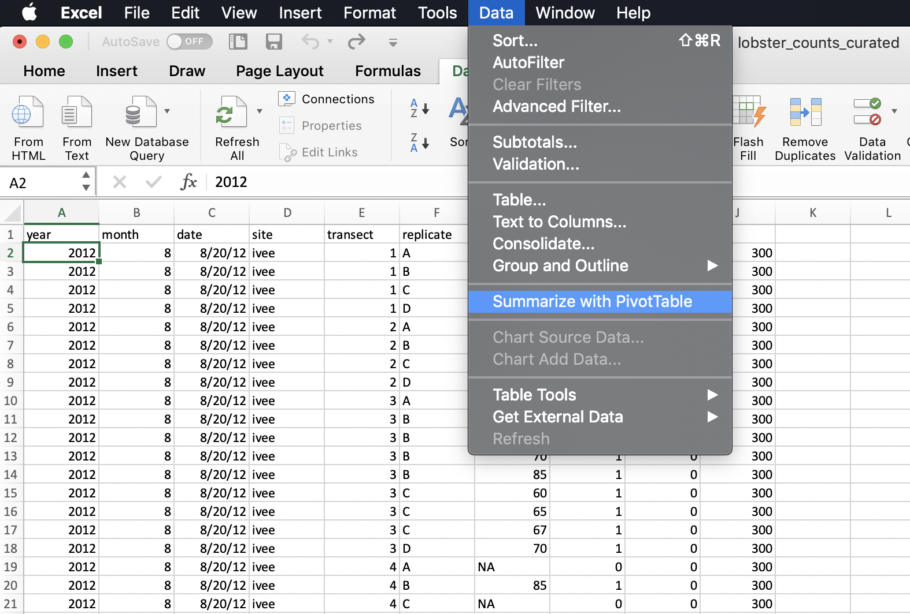
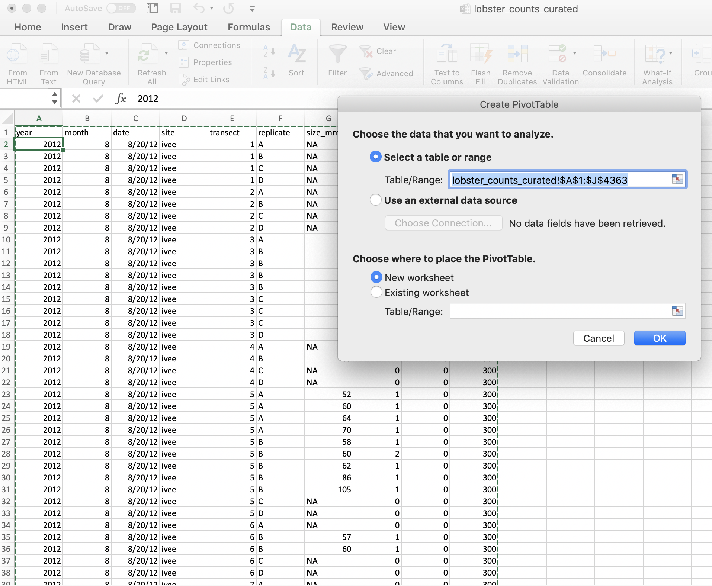
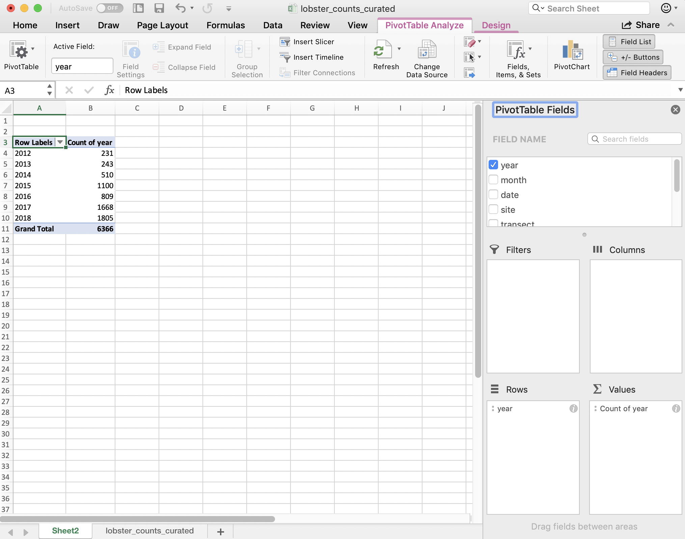

# `dplyr` and Pivot Tables {#pivot}

<!---
Why would you ever want to uncount? You don’t want to assume how future you will want to use this data
How easy is it to get these counts by different groupings
--->

## Summary

Pivot tables are powerful tools in Excel for summarizing data in different ways. We will create these tables using the `group_by` and `summarize` functions from the `dplyr` package (part of the Tidyverse). We will also learn how to format tables and practice creating a reproducible report using RMarkdown and sharing it with GitHub. 

## Objectives

In R, we can use dplyr for pivot tables by using 2 main verbs in combination: `group_by` and `summarize`. We will also continue to emphasize reproducibility in all our analyses.

- Discuss pivot tables in Excel
- Introduce `group_by() %>% summarize()` from the `dplyr` package
- Format tables with the `DT` and `knitr` packages
- Practice our reproducible workflow with RMarkdown and GitHub

## Resources

- [dplyr.tidyverse.org](https://dplyr.tidyverse.org/)
- [R for Data Science: Transform Chapter](https://r4ds.had.co.nz/transform.html)
- [Intro to Pivot Tables I-III](https://youtu.be/g530cnFfk8Y) by Excel Campus (YouTube)

## Lesson

<!---TODO--->

### Setup

Let's start a new RMarkdown file, I'll call mine `pivot_lobsters.Rmd`. 

In the setup chunk, let's attach our libraries and read in our lobster data. 

```{r setup, eval=FALSE}
## attach libraries
library(tidyverse)

## read in data
lobsters <- read_csv("data/lobster_counts_curated.csv")
```

```{r, include = FALSE}
# Teaching version
library(tidyverse)
lobsters <- read_csv("curation/lobster_counts_curated.csv")
```

Let's add a code chunk to explore the data by looking at some summary statistics and making a simple plot. 

```{r}
head(lobsters) # year and month as well as a column for date
summary(lobsters)

ggplot(lobsters, aes(x = year)) +
  geom_bar() +
  facet_wrap(~site)
```

In this data set, every row is a unique observation. This is called "uncounted" data; you'll see there is no row for how many lobsters were seen because each row is an observation, or an "n of 1". 

OK now that we have a quick sense of this data let's have a look at pivot tables in Excel.

### Pivot tables

[Wikipedia describes a pivot table](https://en.wikipedia.org/wiki/Pivot_table) as a "table of statistics that summarizes the data of a more extensive table...This summary might include sums, averages, or other statistics, which the pivot table groups together in a meaningful way." Fun fact: it also says that "Although pivot table is a generic term, Microsoft trademarked PivotTable in the United States in 1994."

#### lobster pivot table

Let's make a pivot table with our lobster data.

I really want to know how many lobsters were counted at each site. I want a count of rows by site. So to do this in Excel we would initiate the Pivot Table Process: 

```{r, echo=FALSE, out.width="80%"}
  
```

<br>

And it will do its best to find the data I would like to include in my Pivot Table (it can have difficulty with non-rectangular or "non-tidy" data), and suggest we make this in a new sheet: 

```{r, echo=FALSE, out.width="80%"}
  
```

<br>

And then we'll get a little wizard to help us create the Pivot Table. I want to summarize by year, so I drag "year" down into the "Rows" box, and to get the counts by year I actually drag the same variable, "year" into the "Values" box. And it will create a Pivot Table for me! But "sum" as the default summary statistic, so I can click the little "I" icon to change this to count.

```{r, echo=FALSE, out.width="80%"}
  
```

<br>

A few things to note: 

- The pivot table is separate entity from our data (it's on a different sheet); the original data has not been affected 
- The pivot table only shows the variables we requested; we don't see other columns (like date, month, or site). 


#### Why are they great? 

Pivot tables are great because they summarize the data and keep the raw data raw — they even promote good pratice because they by default ask you if you'd like to present the data in a new sheet rather than in the same sheet.  

If you add new data, you can refresh your table

#### Why would we want to work in R instead?


Let's talk about how this looks like in R. 


<!---
All verbs work similarly:

1. The first argument is a data frame.
2. The subsequent arguments describe what to do with the data frame. You can refer to columns in the data frame directly without using `$`.
3. The result is a new data frame.

Together these properties make it easy to chain together multiple simple steps to achieve a complex result using the pipe operator `%>%`.

I love thinking of these `dplyr` verbs and the pipe operator `%>%` as telling a story. When I see `%>%` I think "and then":

```{r, eval=FALSE}
data %>%          # start with data, and then
  group_by() %>%  # group by a variable, and then
  mutate() %>%    # mutate to add a new column, and then
  select()        # select specific columns
```


--->
## group_by() %>% summarize()

In R, we can create the functionality of pivot tables by using 2 main `dplyr` verbs in combination: `group_by` and `summarize`. 
  
Say it with me: "pivot tables are group_by and then summarize". And just like pivot tables, you have flexibility with how you are going to summarize. For example, we can calculate an average, or a total. It looks like this (from [RStudio's cheatsheet](http://www.rstudio.com/wp-content/uploads/2015/02/data-wrangling-cheatsheet.pdf)): 

```{r, echo=FALSE, out.width="80%"}
knitr::include_graphics("img/rstudio-cheatsheet-group_by_summarize.png")  
```

### group_by one variable

Let's try this on our `lobsters` data, just like we did in Excel. We will calculate the the total number of lobster by year. In R-speak, we will group_by year and then summarize by counting using the `n()`, which is another function from `dplyr`. We'll also use the pipe operator `%>%`

```{r}
lobsters %>%
  group_by(year) %>%
  summarize(count = n())
```

Notice how together, `group_by` and `summarize` minimize the amount of information we see. We also saw this with the pivot table. We lose the other columns that aren't involved here. 

Question: What if you *don't* group_by first? Let's try it and discuss what's going on.

```{r}
lobsters %>%
  summarize(count = n())
```

So if we don't `group_by` first, we will get a single summary statistic (sum in this case) for the whole dataset. 

Notice that in Excel we retain the overall totals for each site (in bold, on the same line with the site name). This is nice for communicating about data. But it can be problematic for further analyses, because it could be easy to take a total of this column and introduce errors. 

### RStudio Viewer 

Let's now check the `lobsters` variable. We can do this by clicking on `lobsters` in the Environment pane in RStudio. 

We see that we haven't changed any of our original data that was stored in this variable. (Just like how the pivot table didn't affect the raw data on the original sheet). 

> ***Aside***: You'll also see that when you click on the variable name in the Environment pane, `View(lobsters)` shows up in your Console. `View()` (capital V) is the R function to view any variable in the viewer. So this is something that you can write in your RMarkdown script, although RMarkdown will not be able to knit this view feature into the formatted document. So, if you want include `View()` in your RMarkdown document you will need to either comment it out `#View()` or add `eval=FALSE` to the top of the code chunk so that the full line reads `{r, eval=FALSE}`. 

### summarize multiple variables

We can summarize multiple variables at a time. So far we've done the count of lobster observations. Let's also do the mean and standard deviation. First let's use the `mean()` function to calculate the mean. We do this within the same summarize() function, but we can add a new line to make it easier to read. Notice how when you put your curser within the parenthesis and hit return, the indentation will automatically align. 

```{r}
lobsters %>%
  group_by(year) %>%
  summarize(count = n(),
            mean_size_mm = mean(size_mm))
```

> ***Aside*** Command-I will properly indent selected lines.

Great! But this will actually calculate some of the means as NA because one or more values in that year are NA. So we can pass an argument that says to remove NAs first before calculating the average. Let's do that, and then also calculate the standard deviation with the `sd()` function:

```{r}
lobsters %>%
  group_by(year) %>%
  summarize(count = n(), 
            mean_size_mm = mean(size_mm, na.rm=TRUE), 
            sd_size_mm = sd(size_mm, na.rm=TRUE))
```

So we can make the equivalent of Excel's pivot table in R with `group_by` and then `summarize`. But a powerful thing about R is that maybe we want this information to be used in further analyses. We can make this easier for ourselves by saving this as a variable. So let's add a variable assignment to that first line:

```{r}
year_summary <- lobsters %>%
  group_by(year) %>%
  summarize(count = n(), 
            mean_size_mm = mean(size_mm, na.rm = TRUE), 
            sd_size_mm = sd(size_mm, na.rm = TRUE))
```

### Activity

Summarize `lobsters` by site and assign it to a variable called `site_summary`. 

Then, save, commit, and push your RMarkdown file. 

Solution (no peeking): 
```{r}
site_summary <- lobsters %>%
  group_by(site) %>%
  summarize(count = n(), 
            mean_size_mm = mean(size_mm, na.rm=TRUE), 
            sd_size_mm = sd(size_mm, na.rm=TRUE))

site_summary
```

### `group_by` multiple variables

Great. It can be useful to summarize by both site and year, so that we can learn a little more about how things change over time across sites. And, awesomely, we are able to `group_by` more than one variable. Let's do this together, and assign this to a new variable called `siteyear_summary`:

```{r}
siteyear_summary <- lobsters %>%
  group_by(site, year) %>%
  summarize(count = n(), 
            mean_size_mm = mean(size_mm, na.rm = TRUE), 
            sd_size_mm = sd(size_mm, na.rm = TRUE))

siteyear_summary
```

## Formatting tables

There are a growing number of R packages for making tables look presentable and beautiful so you can include them nicely in your reports. We will talk about 2 options here. We will actually go back up to our setup chunk to add these libraries so that we follow the good practice of loading libraries at the beginning of a script. 

```{r}
library(DT) # install.packages("DT")
library(knitr) # install.packages("knitr")
```

### `knitr::kable()`

The `knitr` package has a function called `kable()` that will write the output of a dataframe as a table formatted in Markdown. Let's have a look:

```{r}
kable(site_summary)
```

When we run this we see there are `|` symbols separating columns, and there are `---`'s indicating the column headers. Additionally, the `:` on the right of each `---` symbol makes the values right-alighned. 

Now let's knit our RMarkdown document and see what this looks like rendered. It's a nice, static table. 

### `DT::datatable()`

The DT package had a function called `datatable`; let's try it with our `siteyear_summary` object:

```{r}
datatable(site_summary)
```

When we run this, notice how this actually pops up in our Viewer tab in the bottom right. It's interactive so we can sort by different columns. 

Let's knit our RMarkdown file and see what happens. This interactive table is included in the report!

How can we make this look a bit snazzier? 

There are also many other options to walk through here: https://rstudio.github.io/DT/

### Activity

Use `datatable` to create an interactive table for our `yearsite_summary` object. 

Knit, commit, and push to GitHub. 

### `dplyr::count()`

Now that we've spent time with group_by %>% summarize, there is a shortcut if you only want to summarize by count. This is with a function called `count()`, and it will group_by your selected variable, count, and then also ungroup. It looks like this: 

```{r, eval=FALSE}
lobsters %>%
  count(site, year) 

## This is the same as:
lobsters %>%
  group_by(site, year) %>% 
  summarize(n = n()) %>%
  ungroup()

```

Switching gears...

## `mutate()` 

There are a lot of times where you don't want to summarize your data, but you do want to operate beyond the original data. This is often done by adding a column. We do this with the `mutate()` function from `dplyr`. Let's try this with our original lobsters data. The sizes are in millimeters but let's say it was important for them to be in meters. We can add a column with this calculation: 

```{r}
# quick reminder what this looks like
head(lobsters)

lobsters %>%
  mutate(size_m = size_mm / 1000)
```

If we want to add a column that has the same value repeated, we can pass it just one value, either a number or a character string (in quotes):

```{r}
lobsters %>%
  mutate(millenia = 2000,
         observer = "Allison Horst")
```

<!---
select() for reshuffling columns?
--->

## Deep thoughts

Highly recommended read: [Broman & Woo: Data organization in spreadsheets](https://peerj.com/preprints/3183/). Practical tips to make spreadsheets less error-prone, easier for computers to process, easier to share

Great opening line: "Spreadsheets, for all of their mundane rectangularness, have been the subject of angst and controversy for decades."


## Efficiency Tips

arrow keys with shift, option, command


<!---And that's the end of Day 1! --->
