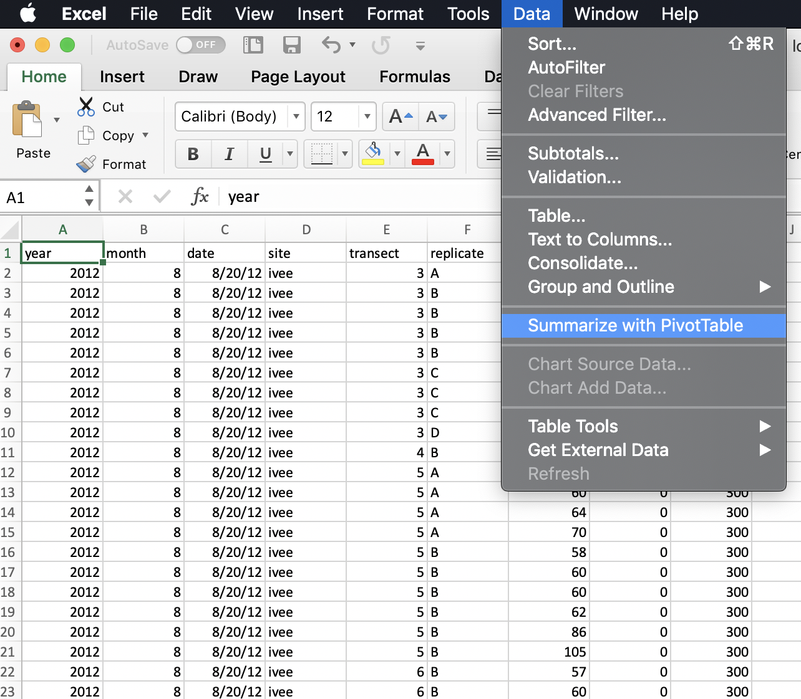
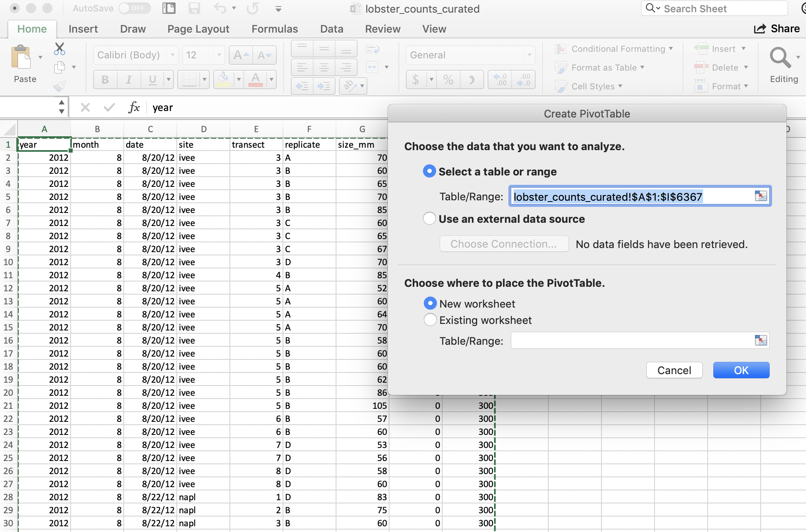

# `dplyr` and Pivot Tables {#pivot}

TODO: 
use lobster data.
Start with counted data and show uncount and discuss why it's important to have counted data
Count and uncount, summary statistics
Use uncounted lobster data
summarize(mean, sd, n) with uncounted lobster data (stdev in excel?)
DT, kable — introduce this and then will be repeated in tidying
if time, could we show count vs n but if you want to get other statistics

Why would you ever want to uncount? You don’t want to assume how future you will want to use this data
How easy is it to get these counts by different groupings
Simplest ggplot (introduced in readxl chapter)


## Summary (a few sentences)

We will learn how to wrangle data in R, using the `dplyr` package which is included in the `tidyverse`. package. In this session, we'll focus on the functions in `dplyr` that operate like Excel's pivot tables.


## Objectives (more detailed, bulletpoints?)

In R, we can use dplyr for pivot tables by using 2 main verbs in combination: `group_by` and `summarize`, and that's where we'll start. Then, we will learn 2 critical verbs that are powerful for data wrangling: `mutate` and `select`.

We will also continue to emphasize reproducibility in all our analyses.

- Practice our reproducible workflow with RMarkdown and GitHub
- Discuss pivot tables in Excel
- Introduce the `dplyr` package in R


## Resources

- [dplyr.tidyverse.org](https://dplyr.tidyverse.org/)
- [R for Data Science: Transform Chapter](https://r4ds.had.co.nz/transform.html)
- [Intro to Pivot Tables I-III](https://youtu.be/g530cnFfk8Y) by Excel Campus


## Lesson

TODO
We've talked about 


### Setup

Let's start a new RMarkdown file, I'll call mine `pivot_lobsters.Rmd`. 

In the setup chunk, let's attach our libraries and read in our lobster data. 

```{r setup, eval=FALSE}
## attach libraries
library(tidyverse)

## read in data
lobster_counts <- read_csv("lobster_counts_curated.csv")
```

```{r, include = FALSE}
# Teaching version
library(tidyverse)
lobster_counts <- read_csv("curation/lobster_counts_curated.csv")
```

Let's add a code chunk to explore the data by looking at some summary statistics and making a simple plot. 

```{r}
#TODO
head(lobster_counts) # year and month as well as a column for date
summary(lobster_counts)

# summary, head, tail, depending on readxl
# ggplot
```

In this data set, every row is a unique observation. This is called "uncounted" data; you'll see there is no row for how many lobsters were seen because each row is an observation, or an "n of 1". 

OK now that we have a quick sense of this data let's have a look at pivot tables in Excel.

### Pivot tables

[Wikipedia describes a pivot table](https://en.wikipedia.org/wiki/Pivot_table) as a "table of statistics that summarizes the data of a more extensive table...This summary might include sums, averages, or other statistics, which the pivot table groups together in a meaningful way." Fun fact: it also says that "Although pivot table is a generic term, Microsoft trademarked PivotTable in the United States in 1994."

#### lobster pivot table

Let's make a pivot table with our lobster data.

I really want to know how many lobsters were counted at each site. I want a count of rows by site. So to do this in Excel we would initiate the Pivot Table Process: 

```{r, echo=FALSE, out.width="80%"}
  
```

<br>

And it will do its best to find the data I would like to include in my Pivot Table (it can have difficulty with non-rectangular or "non-tidy" data), and suggest we make this in a new sheet: 

```{r, echo=FALSE, out.width="80%"}
  
```

<br>

And then we'll get a little wizard to help us create the Pivot Table. I want to summarize by year, so I drag "year" down into the "Rows" box, and to get the counts by year I actually drag the same variable, "year" into the "Values" box. And it will create a Pivot Table for me! But "sum" as the default summary statistic, so I can click the little "I" icon to change this to count.

```{r, echo=FALSE, out.width="80%"}
knitr::include_graphics("img/pivot-table-count-year.png")  
```

<br>

A few things to note: 

- The pivot table is separate entity from our data (it's on a different sheet); the original data has not been affected 
- The pivot table only shows the variables we requested; we don't see other columns (like date, month, or site). 


#### Why are they great? 

Pivot tables are great because they summarize the data and keep the raw data raw — they even promote good pratice because they by default ask you if you'd like to present the data in a new sheet rather than in the same sheet.  

If you add new data, you can refresh your table

#### Why would we want to work in R instead?


Let's talk about how this looks like in R. 

## `dplyr` overview CUYT THIS> the analogous thing is group_by summarize

`dplyr` is a grammar of data manipulation that provides a consistent set of verbs that help you solve the most common data manipulation challenges. These common verbs are: 

- **`filter()`**: pick observations by their values

  `r htmltools::img(src='img/rstudio-cheatsheet-filter.png', width=300)` 
    
- **`select()`**: pick variables by their names

  `r htmltools::img(src='img/rstudio-cheatsheet-select.png', width=300)`
    
- **`mutate()`**: create new variables with functions of existing variables 

  `r htmltools::img(src='img/rstudio-cheatsheet-mutate.png', width=300)`
    
- **`summarise()`**: collapse many values down to a single summary 

  `r htmltools::img(src='img/rstudio-cheatsheet-summarise.png', width=300)`
  
- **`arrange()`**: reorder the rows

These can all be used in conjunction with `group_by()` which changes the scope of each function from operating on the entire dataset to operating on it group-by-group. These six functions provide the verbs for a language of data manipulation.

All verbs work similarly:

1. The first argument is a data frame.
2. The subsequent arguments describe what to do with the data frame. You can refer to columns in the data frame directly without using `$`.
3. The result is a new data frame.

Together these properties make it easy to chain together multiple simple steps to achieve a complex result using the pipe operator `%>%`.

I love thinking of these `dplyr` verbs and the pipe operator `%>%` as telling a story. When I see `%>%` I think "and then":

```{r, eval=FALSE}
data %>%          # start with data, and then
  group_by() %>%  # group by a variable, and then
  mutate() %>%    # mutate to add a new column, and then
  select()        # select specific columns
```

## group_by() %>% summarize()

In R, we can create the functionality of pivot tables by using 2 main `dplyr` verbs in combination: `group_by` and `summarize`. 
  
Say it with me: "pivot tables are group_by and then summarize". And just like pivot tables, you have flexibility with how you are going to summarize. For example, we can calculate an average, or a total.

### group_by one variable

Let's try this on our `lobster_counts` data, just like we did in Excel. We will calculate the the total number of lobster by year. In R-speak, we will group_by year and then summarize by counting using the `n()`, which is another function from `dplyr`. We'll also use the pipe operator `%>%`

```{r}
lobster_counts %>%
  group_by(year) %>%
  summarize(count = n())
```

Notice how together, `group_by` and `summarize` minimize the amount of information we see. We also saw this with the pivot table. We lose the other columns that aren't involved here. 

Question: What if you *don't* group_by first? Let's try it and discuss what's going on.

```{r}
lobster_counts %>%
  summarize(total_lobster = sum(count))
```

So if we don't `group_by` first, we will get a single summary statistic (sum in this case) for the whole dataset. 

Notice that in Excel we retain the overall totals for each site (in bold, on the same line with the site name). This is nice for communicating about data. But it can be problematic for further analyses, because it could be easy to take a total of this column and introduce errors. 

### RStudio Viewer 

Let's now check the `lobster_counts` variable. We can do this by clicking on `lobster_counts` in the Environment pane in RStudio. 

We see that we haven't changed any of our original data that was stored in this variable. (Just like how the pivot table didn't affect the raw data on the original sheet). 

> ***Aside***: You'll also see that when you click on the variable name in the Environment pane, `View(lobster_counts)` shows up in your Console. `View()` (capital V) is the R function to view any variable in the viewer. So this is something that you can write in your RMarkdown script, although RMarkdown will not be able to knit this view feature into the formatted document. So, if you want include `View()` in your RMarkdown document you will need to either comment it out `#View()` or add `eval=FALSE` to the top of the code chunk so that the full line reads `{r, eval=FALSE}`. 

### summarize multiple variables

We can summarize multiple variables at a time. So far we've done the count of lobster observations. Let's also do the mean and standard deviation. First let's use the `mean()` function to calculate the mean. We do this within the same summarize() function, but we can add a new line to make it easier to read. Notice how when you put your curser within the parenthesis and hit return, the indentation will automatically align. 

```{r}
lobster_counts %>%
  group_by(year) %>%
  summarize(count = n(),
            mean_size_mm = mean(size_mm))
```

> ***Aside*** Command-I will properly indent selected lines.

Great! But this will actually calculate some of the means as NA because one or more values in that year are NA. So we can pass an argument that says to remove NAs first before calculating the average. Let's do that, and then also calculate the standard deviation with the `sd()` function:

```{r}
lobster_counts %>%
  group_by(year) %>%
  summarize(count = n(), 
            mean_size_mm = mean(size_mm, na.rm=TRUE), 
            sd_size_mm = sd(size_mm, na.rm=TRUE))
```

So we can make the equivalent of Excel's pivot table in R with `group_by` and then `summarize`. But a powerful thing about R is that maybe we want this information to be used in further analyses. We can make this easier for ourselves by saving this as a variable. So let's add a variable assignment to that first line:

```{r}
year_summary <- lobster_counts %>%
  group_by(year) %>%
  summarize(count = n(), 
            mean_size_mm = mean(size_mm, na.rm=TRUE), 
            sd_size_mm = sd(size_mm, na.rm=TRUE))
```

### Activity

Summarize `lobster_counts` by site and assign it to a variable called `site_summary`. 

Solution (no peeking): 
```{r, eval=FALSE}
site_summary <- lobster_counts %>%
  group_by(site) %>%
  summarize(count = n(), 
            mean_size_mm = mean(size_mm, na.rm=TRUE), 
            sd_size_mm = sd(size_mm, na.rm=TRUE))
```

### group_by multiple variables

Great. It can be useful to summarize by both site and year, so that we can learn a little more about how things change over time across sites. And, awesomely, we are able to `group_by` more than one variable. Let's do this together, and assign this to a new variable called `site_year_summary`:

```{r}
site_year_summary <- lobster_counts %>%
  group_by(site, year) %>%
  summarize(count = n(), 
            mean_size_mm = mean(size_mm, na.rm=TRUE), 
            sd_size_mm = sd(size_mm, na.rm=TRUE))

site_year_summary
```

Now that we've spent time with group_by %>% summarize, there is a shortcut if you only want to summarize by count. This is with a function called `count()`, and it will group_by your selected variable, count, and then also ungroup. It looks like this: 

```{r, eval=FALSE}
lobster_counts %>%
  count(site, year) 

## This is the same as:
lobster_counts %>%
  group_by(site, year) %>% 
  summarize(n = n()) %>%
  ungroup()

```

So we have seen how powerful it can be to group_by and summarize. We will revisit this in a moment, but now let's move on to our next `dplyr` verb. 

## `mutate()`

We use the `mutate()` function to add columns to a data frame. This is one of the most common things that I do in Excel: you need to name the new column, and then you can fill it with new values. From the help pages, we learn that unlike `summarize()`, `mutate()` preserves the number of rows of the input. Additionally, new variables overwrite existing variables of the same name.

Let's say we need to add a column that indicates that these observations were made by SCUBA diving. To do this, first we tell R we want to add a new column using the `mutate()` function. Then, we tell it the name of the column we want, let's call it `observation_type`. Then, we tell it the value we want in the cells: let's say `"SCUBA"`. We need to put SCUBA in quotes because it's not a numeric value:

```{r}
lobster_counts %>%
  mutate(observation_type = "SCUBA")
```

Notice that when you just give one value like "SCUBA", mutate will repeat this value for you; it's the equivalent in Excel to when you grab the bottom right corner of a cell and drag down. 

Let's try a calculation. Let's calculate the total count for the whole data site as we did above. We add a new column named `n`:

```{r}
lobster_counts %>%
  mutate(total = n())
```

And notice that this was the same calculated value as when we did this with summarize, but here it is repeated for every row instead of being collapsed. 

### Activity

Take 3 minutes to add a new column to the data frame; discuss with your neighbor for ideas! 

### `group_by() %>% mutate()`

So there are many things you could add to a new column; but let's focus on how powerful mutate can be in combination with `group_by`. So just like we were just doing `group_by() %>% summarize()`, we can do `group_by() %>% mutate()`. 

Let's add a new column named `siteyear_counts`, and we will calculated after grouping by site and year. Let's have a look at it first, and then we will assign it as a variable in a moment.

```{r}
lobster_counts %>%
  group_by(site, year) %>%
  mutate(total_siteyear = n())
```

We now have an additional column in our dataframe called `total_siteyear`. And again, if we recall from our `site_year_summary` above, it has calculated the same information. But instead of collapsing our dataframe, we retain all of the information from the other columns, and the `total_siteyear` column will have values that are repeated. 

## mutate() vs summarize()

Why would you use `mutate` instead of `summarize`? Why would you ever want to have that `total_siteyear` column with values repeated like we just did? Why wouldn't you always do `group_by() %>% summarize()` rather than `group_by() %>% mutate()`? The truth is, there is no one way to do anything in R, but there are ways to make your analyses have fewer steps or read more nicely. Let's explore this by doing a bit of analysis. 

Let's say we want to calculate the percentage of lobster found at each site each year. This means we are going to do a calculation using both the raw and summary data. And we're going to do it in 2 ways, first using `group_by() %>% summarize()` and then `group_by() %>% mutate()`. 

Let's start off doing this as a `group_by() %>% mutate()`. 

```{r}
lobster_percs <- lobster_counts %>%
  group_by(year) %>%
  mutate(total_year = n()) %>%
  ungroup() %>%
  group_by(site, year) %>%
  mutate(total_siteyear = n()) %>%
  mutate(perc_lobster = total_siteyear/total_year*100)
```

When I'm doing analyses, I like `group_by() %>% mutate()` because I can build out the logic step-by-step and actually look at it as it builds. It's both comforting and good for error-checks; I can do what we call "spot checks" of calculating a few values by hand to make sure it's working. This would also be relatively easy for someone else to follow. 

If we wanted to do this with `group_by() %>% summarize()` we would need a few more steps. We can write it up as pseudo-code:

```{r, eval=FALSE}

## first calculate lobster siteyear_counts
x <- lobster_counts %>%
  group_by(site, year) %>%
  summarize(siteyear_counts = sum(count)) 

## then somehow join or merge that information to the lobster_counts data 
x %>%
  mutate(perc_lobster = count/siteyear_counts*100)
```

In order to calculate the percentages with the appropriate values, we need to somehow join the summarized data back to the lobster_counts. This actually requires a few more dplyr verbs: filter and *_join; we will do this tomorrow! <!---TODISCUSS w/ Allison: does this cliffhanger make sense?---> 

count column (would have to uncount first)

## Deep thoughts

Highly recommended read: [Broman & Woo: Data organization in spreadsheets](https://peerj.com/preprints/3183/). Practical tips to make spreadsheets less error-prone, easier for computers to process, easier to share

Great opening line: "Spreadsheets, for all of their mundane rectangularness, have been the subject of angst and controversy for decades."


## Efficiency Tips

arrow keys with shift, option, command


<!---And that's the end of Day 1! --->
