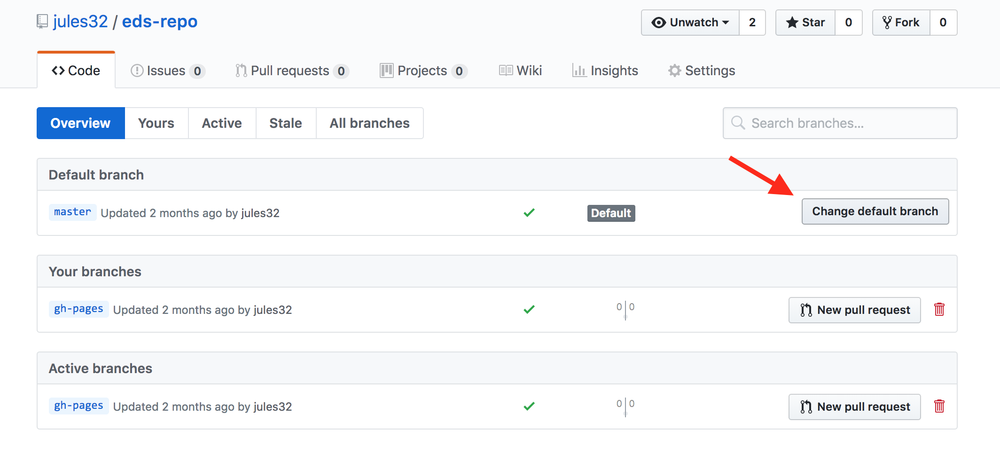

# Formatting and Sharing {#format}

## Summary (a few sentences)

We are going to focus on formatting a table nicely and sharing it by publishing it to GitHub. 

## Objectives (more detailed, bulletpoints?)

## Resources

- [Happy Git With R](https://happygitwithr.com/)
- [Openscapes lesson series](https://openscapes.github.io/series)

## Introduction / our analytical plan

Generally, you can name things whatever you want; we try to do this is a way that is meaningful to you and others but is also succinct. But in this lesson there are going to be 2 things that must have specific names, which will let us create a website. These 2 things are `index.Rmd` and `gh-pages`. We'll see them soon. 

<TODO: More here>


We'll create a new RMarkdown document — and this is the first of these 2 names we mentioned above. **Name your new R Markdown file `index.Rmd`**. Lowercase "i". 

TODO: read in data from googlesheets. Substrate cover?

```{r googlesheets}

```


Wrangle data

```{r wrangle substrate}

```

Now let's knit! Let's make this table look a bit nicer. 

## Formatting tables


### DT

TODO

### kable and kablextra

TODO

## Activity (5 min)

Do the following: 
TODO

1. wrangle xyz
2. something
3. knit to html

Great! Now we want to share this. We'll move beyond emailing Excel Files or sharing them via dropbox or google drive. 

Let's talk about what GitHub is. You can sit back and close your laptops for a moment and we'll have a little tour. 


## GitHub for Publishing

GitHub is a powerful tool for collaborative coding with version control, but we are going to focus on some of its lesser-celebrated awesomeness: GitHub for publication. 

We are going to work with GitHub from the browser only, because it makes the best use of our short time together. It is also a powerful way for folks to contribute and collaborate even if they are not involved in day-to-day hands-on analysis. So this might be good for you and your colleagues to have a gentle entryway into GitHub together. 

GitHub can reduce friction collaboration: it gives us avenues for communicating and publishing methods, blogs, interactive graphics and more, without a lot of heavy lifting!

### What is GitHub? — Traditional answer

GitHub means GitHub.com; it’s a company that is an online collaborative platform, with some features familiar to social media users.

GitHub centers around git, which is powerful version control software for your local computer. This has been around for years, taking care of bookkeeping for you locally on your computer. 

GitHub makes git's local bookkeeping collaborative through its powerful online platform. It will weave together all the version control from your local computer with other collaborators you work with. 

It is used for code and files: organize,  archive, bookkeeping, searchable, changes visualized, etc. In the figure below, notice the familiar red and green to denote deletions and additions line-by-line, with darker shading to identify  specific text within a line. Also notice the differencing in the image's color bar!

<br> 

```{r, echo=FALSE, out.width="80%", out.extra='style="background-color: gray; padding:2px; display: inline-block;"'}
  
# https://github.com/OHI-Science/arc/commit/931d967ee0b85992f2f6cd37ee79c705f9f056b2?short_path=6a78fa2#diff-6a78fa24f588c99eca20ff4d8c9071f8
```

<br> 


We aren’t going to teach traditional git/GitHub today, but here are some recommendations if you'd like to learn. First, get a sense of what is possible with GitHub by reading Jenny Bryan's "Excuse Me, Do You Have a Moment to Talk About Version Control?" (open-access pre-print from [PeerJ](https://peerj.com/preprints/3159/), published in [The American Statistican](https://www.tandfonline.com/doi/full/10.1080/00031305.2017.1399928)). Next, to setup and use GitHub with R, the absolute best resource is Jenny Bryan's [Happy Git With R](https://happygitwithr.com/). This is a comprehensive, friendly step-by-step process of how to do so, and is an awesome reference for seasoned git/GitHub users as well. 

### What is GitHub? — Non-traditional answer

GitHub is a publishing platform, for single-paged RMarkdown documents like we've been creating, or for books like this one:  ([r-for-excel-users](https://jules32.github.io/series)). You can also publish simple websites and interactive dashboards! 


## GitHub framework in a nutshell

This is a demo: 

<br> 

```{r, out.width="80%", out.extra='style="background-color: gray; padding:2px; display: inline-block;"'}
knitr::include_graphics("img/github-orientation.png")  
```

<br> 


### Users vs. organizations

Example: [jules32](https://github.com/jules32) is a user account, [rstudio-conf-2020](https://github.com/rstudio-conf-2020) is an organization group. 

You can think of them like other social media accounts: I can be an individual or part of a group, and there are permissions associated with both.

### Repositories (“repos”)

Repos are GitHub’s main unit. They are essentially a folder, and you'll put files and folders in them. They are contained, with permissions specific to each one. 

It makes it easier to navigate through and find stuff — so you are "not sifting through a zoo of files" as one of our colleagues says. 

### “Commits” & “commit messages”

Unlike Dropbox or Google Drive that constantly and automatically sync to the cloud, you have to deliberately tell git/GitHub when you have an amount of work that you want to be versioned and synced. You have to commit to telling them. GitHub takes care of the backend bookkeeping involved, but you have to write a human-readable message to your future self and others. That is the commit message. 

There is no absolute guidance for how often to commit, but I think of it as leaving breadcrumbs for yourself. How much work and on what things/in what combination would you like to be able to reverse? What kind of information will make it easier for Future You to work with?

### Public vs private

You can have both public (the free default) and private repositories, and change these permissions later on. I mostly work in public repos, but if I work in private ones, I often have the expectation that they will be made public some day. So I practice good habits with commits and documentation, and keep conversations on-topic.

### The search feature is awesome

You are able to search within a GitHub repository, across repositories in an organization, or across all GitHub public repositories. I find this helps me find things quickly if I'm looking for how I've used a function in the past, or if I remember a word that would stand out that I included in a commit message as a breadcrumb to myself. It will also search Issues within the repositories, so you can look for specific words in conversations as well. 

### Branches & Forks

We're not going to talk about branches and forks. These are a core feature of what makes GitHub super powerful for software development, and one of the first things you'll see in GitHub tutorials geared towards software engineers. But I do not think that is the most relevant or smoothest entryway for those of us who are scientists fairly new to collaborative coding and version control. 

### Issues

Every GitHub repository (shortened to "repo") has a feature called Issues. Issues is GitHub's project management and task-tracking feature. 

> Issues “track ideas, enhancements, tasks, or bugs for work on GitHub.” - [GitHub](https://help.github.com/en/articles/about-issues)

You create an Issue for a topic, and use it track progress or ask questions. You can provide links, describe updates, link to other Issues, and you can close the Issue when it is completed. You can also re-open previously-closed Issues.

Every GitHub repository has this Issues feature. This means that sometimes Issues are public and sometimes they are private. 

- In a public repo, anyone with a GitHub username can create and comment on issues. 
- In a private repo, only users with permission can create and comment on issues, or see them at all

We won't talk about Issues more today in this course but if you're interested read Jenny Bryan's ["Excuse Me, Do You Have a Moment to Talk About Version Control?"](https://peerj.com/preprints/3159/) and Openscapes' [GitHub for Project Management](https://openscapes.github.io/series/github-issues) chapter.

OK that's all for the hands-off portion, let's get back to our computers. 

## Create a GitHub user account

You will need to create **Github** account at <http://github.com>, if you don't already have one. For username, I recommend all lower-case letters, short as you can. 

*Note! Shorter names that kind of identify you are better, and use your work email!*

## Create a repo 

You can name it anything. Since it is going to be about our substrate analysis, I'll name mine `substrate-report`. 

### Create a gh-pages branch

I know I said we weren't going to talk about branches. Except for this. By default, when you create a new repo you begin with one branch, and it is named `master`. When you create new branches, you can name them whatever you want. However, if you name one `gh-pages` (all lowercase, with a `-` and no spaces), this will let you create a website. And that's our plan. Everyone, do the following to create a `gh-pages` branch: 

On the homepage for your repo on GitHub.com, click the button that says "Branch:master". Here, you can switch to another branch (right now there aren't any others besides `master`), or create one by typing a new name. 


<br>

Let's type `gh-pages`. 

<br>

 

Let's also change `gh-pages` to the default branch and delete the master branch: this will be a one-time-only thing that we do here: 

First click to control branches:

 

And then click to change the default branch to `gh-pages`. I like to then delete the `master` branch when it has the little red trash can next to it. It will make you confirm that you really want to delete it, which I do!

 

TODO: CONTINUE!

## Fun facts (quirky things) - making a note of these wherever possible for interest (little “Did you know?” sections)
## Interludes (deep thoughts/openscapes)
## Our Turn Your Turn 1
## Our Turn Your Turn 2
## Efficiency Tips

