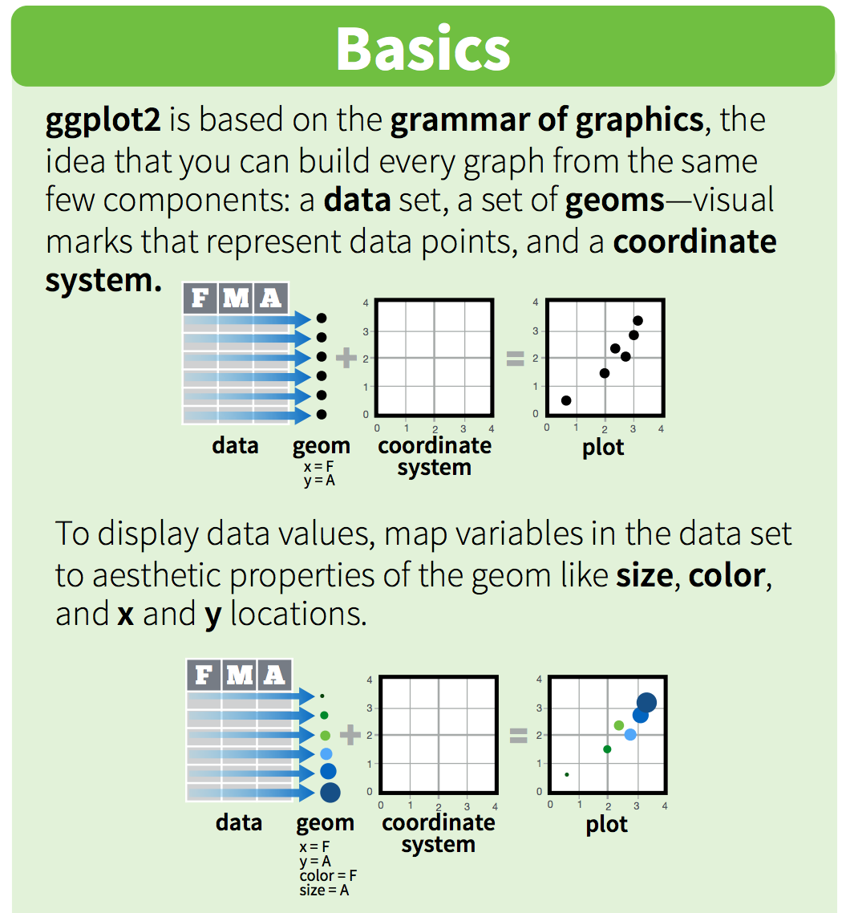

# Graphs with ggplot2 {#ggplot2}

## Summary

Now that we know how to *get* some data, the next thing we'll probably want to do is *look* at it. In Excel, graphs are made by manually selecting options - which, as we've discussed previously, may not be the best option for reproducibility. Also, if we haven't built a graph with reproducible code, then we might not be able to easily recreate a graph *or* use that code again to make the same style graph with different data.

Using `ggplot2`, the graphics package within the `tidyverse`, we'll write reproducible code to manually and thoughtfully build our graphs. 

> "ggplot2 implements the grammar of graphics, a coherent system for describing and building graphs. With ggplot2, you can do more faster by learning one system and applying it in many places." - [R4DS](http://r4ds.had.co.nz/data-visualisation.html)

We'll use the `ggplot2` package, but the function we use to initialize a graph will be `ggplot`, which works best for data in tidy format (i.e., a column for every variable, and a row for every observation). Graphics with `ggplot` are built step-by-step, adding new elements as layers with a plus sign (`+`) between layers (note: this is different from the pipe operator, `%>%`. Adding layers in this fashion allows for extensive flexibility and customization of plots.

<br>


## Objectives

- Create several common types of graphs (scatterplot, column, line) in ggplot2
- Learn basics of customization (color, style, themes, etc.)
- Faceted graphs
- Exporting figures with `ggsave()`

## Resources

- [https://r4ds.had.co.nz/data-visualisation.html](Chapter 3 - Data Visualization in R for Data Science by Grolemund and Wickham)
- [ggplot2-cheatsheet-2.1.pdf](https://www.rstudio.com/wp-content/uploads/2016/11/ggplot2-cheatsheet-2.1.pdf)  
- [Graphs with ggplot2 - Cookbook for R](http://www.cookbook-r.com/Graphs/#graphs-with-ggplot2)  
- ["Why I use ggplot2" - David Robinson Blog Post](http://varianceexplained.org/r/why-I-use-ggplot2/)

## Lesson

### Getting started - Create a new .Rmd, attach packages & get data

Within your existing version-controlled R project, create a new R Markdown document with title "Session 4 - Data visualization with ggplot2." Remove everything below the first code chunk. Knit and save the .Rmd file within your project working directory as "session_4_ggplot2". 

The `ggplot2` package is part of the `tidyverse`, so we don't need to attach it separately. Attach the `tidyverse` and `readxl` packages in the top-most code chunk of your .Rmd. 
```{r, message = FALSE}
library(tidyverse)
library(readxl)
```

In this session, we'll use data for parks visitation from two files: 

- A comma-separated-value (CSV) file containing visitation data for all National Parks in California (ca_np.csv)
- A single Excel worksheet containing only visitation for Channel Islands National Park

**A bit about Channel Islands National Park**: TODO

Add a new code chunk to read in the data from the **data** subfolder within your working directory. 
```{r, include = FALSE}
ca_np <- read_csv(here::here("curation", "ca_np.csv"))
ci_np <- read_xlsx(here::here("curation", "ci_np.xlsx"))
```

```{r, eval = FALSE}
ca_np <- read_csv(here::here("data", "ca_np.csv"))
ci_np <- read_xlsx(here::here("data", "ci_np.xlsx"))
```

Let's take a quick look at the data to see what it contains. For example: 

- `View()`: to look at the object in spreadsheet format
- `names()`: to see the variable (column) names
- `summary()`: see a quick summary of each variable


## Fun facts (quirky things) - making a note of these wherever possible for interest (little “Did you know?” sections)
## Interludes (deep thoughts/openscapes)
## Our Turn Your Turn 1
## Our Turn Your Turn 2
## Efficiency Tips

