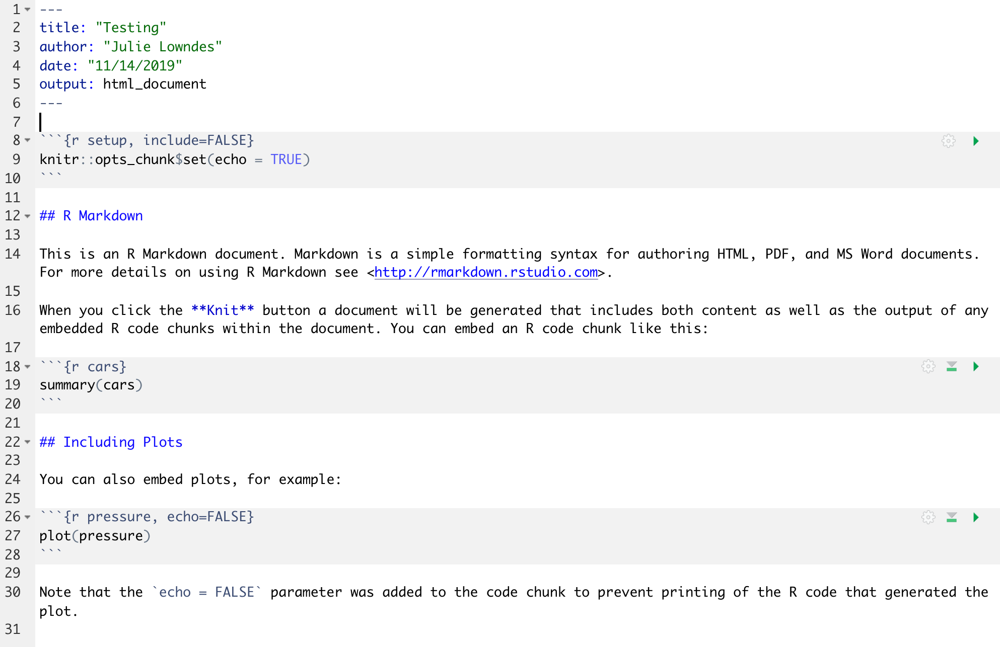

# R & RStudio, RMarkdown {#rstudio}

TODO: Intro: we're going to start off with RMarkdown. 

TODO: break into "R chunks" and "Markdown sections"

TODO: harmonize with OHI's training

Introduce projects and setup data/ folder. I like to turn off workbook mode. 


TODO (write out): 
Intro, knitting
How in-line figures are awesome (no copy-pasting from excel to word)
Reproducibility is important (this might be new to some people). Reproducible research/self-contained Rmd files: read in data at the top. Read_csv.

## Summary

We'll learn RMarkdown, which helps you tell a story with your data analysis because you can write text alongside the code. We are actually learning two languages at once: R and Markdown. 

## Objectives (more detailed, bulletpoints?)

## Resources

## Intro to RMarkdown

An RMarkdown file will allow us to weave markdown text with chunks of R code to be evaluated and output content like tables and plots. This is super cool, and really best to experience before we talk about it. So let's do this together. 

### Create an RMarkdown file

File -> New File -> RMarkdown... -> Document of output format HTML, OK.

```{r, echo=FALSE, out.width="80%"}
knitr::include_graphics("img/rstudio_new-rmd-doc-html.png")  
```

You can give it a Title like "Testing" (a name that's totally ok to use as you're trying something out). Then click OK. 

OK, first off: by opening a file, we are seeing the 4th pane of the RStudio console, which is essentially a text editor. This lets us organize our files within RStudio instead of having a bunch of different windows open.

Let's have a look at this file — it's not blank; there is some initial text is already provided for you. Notice a few things about it: 

- Title and Author are auto-filled, and the today's date has been added
- There are white and grey sections. These are the 2 main languages that make up an RMarkdown file. 
  - **Grey sections are R code**
  - **White sections are Markdown text**
  
```{r, echo=FALSE, out.width="80%"}
  
```


### Knit your RMarkdown file

Let's go ahead and "Knit" by clicking the blue yarn at the top of the RMarkdown file. It's going to ask us to save first, I'll name mine "testing.Rmd".

How cool is this, we've just made an html file, a webpage that we are viewing locally on our own computers. Knitting this RMarkdown document has rendered — we also say formatted — both the Markdown text (white) and the R code (grey), and the it also executed — we also say ran — the R code.  

Let's have a look at them side-by-side: 

<br>

```{r, echo=FALSE, out.width="80%"}
knitr::include_graphics("img/rmarkdown_side_by_side.png")  
```

Let's take a deeper look at these two files. So much of learning to code is looking for patterns.

### Activity (5 mins)

Look at these two files while talking with your neighbor: What do you notice between the two files? Start off with these observations:

- Markdown text (white sections): The two hashtags `##` cause the following text to be displayed as a header: the text is larger and in bold 
- R code (grey sections): The `summary()` function outputs summary statistics and the `plot()` function creates a plot!

And now let's talk about this. 

### R code chunks

Notice how the grey **R code chunks** are surrounded by 3 backticks and `{r LABEL}`. These are evaluated and return the output text in the case of `summary(cars)` and the output plot in the case of `plot(pressure)`.

Notice how the code `plot(pressure)` is not shown in the HTML output because of the R code chunk option `echo=FALSE`. 
COME BACK!!!


We don't know that much R yet, but you can see that we are taking a summary of some data called 'cars', and then plotting. We will focus on R for the rest of the workshop, but for the rest of this morning let's focus on the second language.

The second language is Markdown. This is a formatting language for plain text, and there are only about 15 rules to know. 

Notice the syntax for:

- **headers** get rendered at multiple levels: `#`, `##`
- **bold**: `**word**`

There are some good [cheatsheets](https://github.com/adam-p/markdown-here/wiki/Markdown-Here-Cheatsheet) to get you started, and here is one built into RStudio: Go to Help > Markdown Quick Reference

<br>
<br>

**Important**: note that the hashtag `#` is used differently in Markdown and in R: 

- in R, a hashtag indicates a comment that will not be evaluated. You can use as many as you want: `#` is equivalent to `######`. It's a matter of style. I use two `##` to indicate a comment so that it's clearer what is a comment versus what I don't want to run at the moment.
- in Markdown, a hashtag indicates a level of a header. And the number you use matters: `#` is a "level one header", meaning the biggest font and the top of the hierarchy. `###` is a level three header, and will show up nested below the `#` and `##` headers.

If this seems confusing, take comfort in the fact that you are already used to using `#`s differently in real life: it can mean "number" or "pound" or hashtags on social media.

Learn more: http://rmarkdown.rstudio.com/

### Activity

1. In Markdown write some italic text, make a numbered list, and add a few subheaders.
 Use the Markdown Quick Reference (in the menu bar: Help > Markdown Quick Reference). 
1. Reknit your html file. 


### R chunks


OK. Now let's practice with some of those commands that we were working on this morning.

Create a new chunk in your RMarkdown first in one of these ways: 

- click "Insert > R" at the top of the editor pane
- type by hand 
   \```{r}
   \```
- if you haven't deleted a chunk that came with the new file, edit that one

Now, let's write some R code. 

```
x <- seq(1:15)
```

Now, hitting return does not execute this command; remember, it's a text file in the text editor, it's not associated with the R engine. To execute it, we need to get what we typed in the the R chunk (the grey R code) down into the console. How do we do it? There are several ways (let's do each of them):

1. copy-paste this line into the console.
1. select the line (or simply put the cursor there), and click 'Run'. This is available from 
    a. the bar above the file (green arrow)
    b. the menu bar: Code > Run Selected Line(s)
    c. keyboard shortcut: command-return
1. click the green arrow at the right of the code chunk

Cool tip: doesn't have to be only R, other languages supported. 

### Activity

> Add a few more commands to your file from this morning. Execute them by trying the three ways above. Then, knit your R Markdown file, which will also save the Rmd by default. 


## Activity

1. knit!

Delete everything! Just by being an .Rmd file, this will knit

## Deep thoughts

Command-Z is the best

## Fun facts (quirky things) - making a note of these wherever possible for interest (little “Did you know?” sections)
## Interludes (deep thoughts/openscapes)
## Interludes (deep thoughts/openscapes)

Comments! Organization (spacing, subsections, vertical structure, indentation, etc.)! Well-named variables! Also, well-named operations so analyses (select(data, columnname)) instead of data[1:6,5] and excel equivalent. (Ex with strings)
Not so brittle/sensitive to minor changes.

### RMarkdown video (1-minute)

Let's watch this to demonstrate all the amazing things you can now do: 

[What is RMarkdown?](https://vimeo.com/178485416)


## Efficiency Tips

