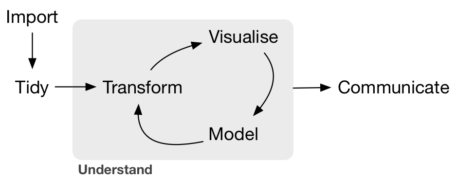

# Synthesis {#synthesis}

## Summary

In this session, we'll pull together the skills that we've learned so far. We'll create a new GitHub repo and R project, wrangle and visualize data from spreadsheets in R Markdown, communicate between RStudio (locally) and GitHub (remotely) to keep our updates safe, then share our outputs in a nicely formatted GitHub ReadMe. And we'll learn a few new things along the way! 



## Objectives

- Create a new repo on GitHub
- Start a new R project, connected to the repo 
- Create a new R Markdown document 
- Attach necessary packages (`googlesheets4`, `tidyverse`, `here`)
- Use `here::here()` for simpler (and safer) file paths
- Read in data from a Google sheet with the `googlesheets4` package in R
- Basic data wrangling (`dplyr`, `tidyr`, etc.)
- Data visualization (`ggplot2`)
- Publish with a useful ReadMe to share

## Resources

- The [`here` package](https://github.com/r-lib/here)
- [googlesheets4](https://github.com/tidyverse/googlesheets4) information
- [Project oriented workflows](https://www.tidyverse.org/blog/2017/12/workflow-vs-script/) by Jenny Bryan

## Lessons

Set-up:

- Log in to your GitHub account and create a new repository called `sea-creature-synthesis`
- Clone the repo to create a version controlled project (remember, copy & paste the URL from the GitHub Clone / Download)
- In the local project folder, create a subfolder called 'data'
- Copy and paste the `fish_counts_curated.csv` and `lobster_counts.csv` into the 'data' subfolder
- Create a new R Markdown document within your `sea-creature-synthesis` project
- Knit your .Rmd to html, saving as `sb_sea_creatures.Rmd`

### Attach packages and read in the data

Attach (load) packages with `library()`:
```{r, include = FALSE}

library(tidyverse)
library(googlesheets4)
library(here)  
library(janitor) 
```

```{r, eval = FALSE}

library(tidyverse)
library(googlesheets4)
library(here)  
library(janitor) 
```

Now we'll read in our files with `readr::read_csv()`, but our files aren't in our **project root**. They're in the `data` subfolder.

Use `here::here()` to direct R where to look for files, if they're not in the project root. Not sure where that is? Type `here()` in the Console, and it will tell you! 

```{r, eval = FALSE}
here::here()
```

`"/returns/your/project/root/"`

Go ahead, find your project root!

Then use `here::here()` *again* to easily locate a file somewhere outside of the exact project root. In our case, the files we want to read in are in the `data` subfolder - so we have to tell R how to get there from the root:

```{r, include = FALSE}
# Read in the data
fish_counts <- read_csv(here::here("curation", "fish_counts_curated.csv"))

# Notice after first line (before proceeding): bad column names, -99999
lobster_counts <- read_csv(here::here("curation","lobster_counts.csv"),
                           na = "-99999") %>% 
  clean_names() # That's better! TODO: Did Julie do this all previously? Fine to repeat eithe way, but best to know what's being repeated or not...
  
```

```{r, eval = FALSE}
# Attach packages:

library(tidyverse)
library(here)
library(janitor)

```


- Read in lobster data with googlesheets4
- Join with another existing data frame (or 2?)
- Pivoting
- Transforming / subsetting
- Grouping & summarizing (for means, sd, count)
- Make a table 
- Make a graph

Possible new things: 
complete() 

## Fun facts (quirky things) - making a note of these wherever possible for interest (little “Did you know?” sections)

## Interludes (deep thoughts/openscapes)

## Efficiency Tips

