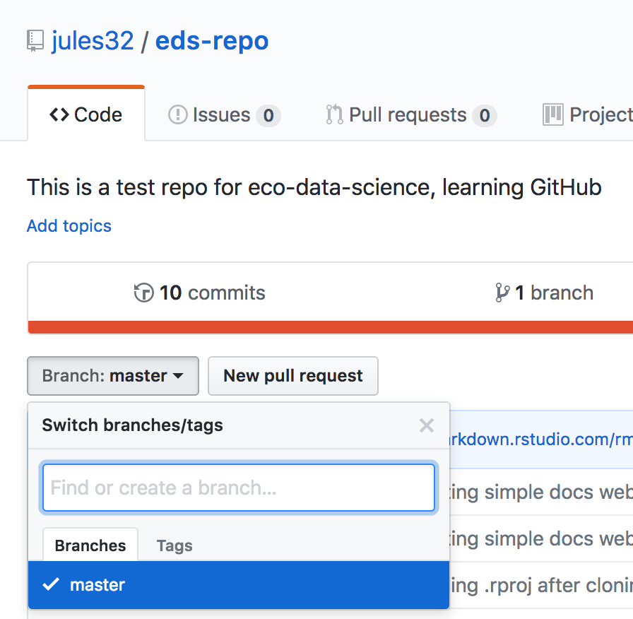
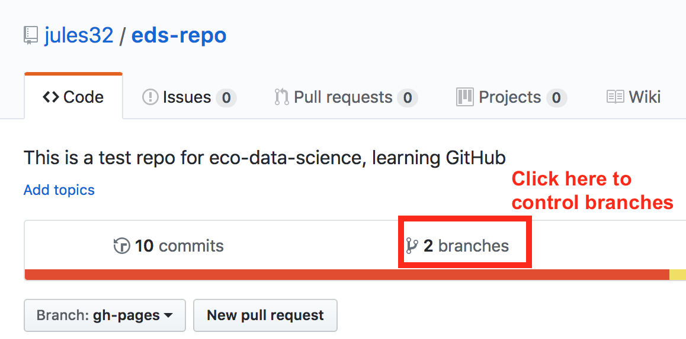

# Formatting and Sharing {#format}

## Summary (a few sentences)

We are going to focus on formatting a table nicely and sharing it by publishing it to GitHub. 

## Objectives (more detailed, bulletpoints?)

## Resources

- [Happy Git With R](https://happygitwithr.com/)
- [Openscapes lesson series](https://openscapes.github.io/series)

## Introduction / our analytical plan

Generally, you can name things whatever you want; we try to do this is a way that is meaningful to you and others but is also succinct. But in this lesson there are going to be 2 things that must have specific names, which will let us create a website. These 2 things are `index.Rmd` and `gh-pages`. We'll see them soon. 

<TODO: More here>


We'll create a new RMarkdown document — and this is the first of these 2 names we mentioned above. **Name your new R Markdown file `index.Rmd`**. Lowercase "i". 

TODO: read in data from googlesheets. Substrate cover?

```{r googlesheets}

```


Wrangle data

```{r wrangle substrate}

```

Now let's knit! Let's make this table look a bit nicer. 

## Formatting tables (15 minutes)


### DT

TODO

### kable and kablextra

TODO

## Activity (5 min)

Do the following: 
TODO

1. wrangle xyz
2. something
3. knit to html

Great! Now we want to share this. We'll move beyond emailing Excel Files or sharing them via dropbox or google drive. 

Let's talk about what GitHub is. You can sit back and close your laptops for a moment and we'll have a little tour. 


## GitHub for Publishing

GitHub is a powerful tool for collaborative coding with version control, but we are going to focus on some of its lesser-celebrated awesomeness: GitHub for publication. 

We are going to work with GitHub from the browser only, because it makes the best use of our short time together. It is also a powerful way for folks to contribute and collaborate even if they are not involved in day-to-day hands-on analysis. So this might be good for you and your colleagues to have a gentle entryway into GitHub together. 

GitHub can reduce friction collaboration: it gives us avenues for communicating and publishing methods, blogs, interactive graphics and more, without a lot of heavy lifting!

### Issues

Every GitHub repository (shortened to "repo") has a feature called Issues. Issues is GitHub's project management and task-tracking feature. 

> Issues “track ideas, enhancements, tasks, or bugs for work on GitHub.” - [GitHub](https://help.github.com/en/articles/about-issues)

You create an Issue for a topic, and use it track progress or ask questions. You can provide links, describe updates, link to other Issues, and you can close the Issue when it is completed. You can also re-open previously-closed Issues.

Every GitHub repository has this Issues feature. This means that sometimes Issues are public and sometimes they are private. 

- In a public repo, anyone with a GitHub username can create and comment on issues. 
- In a private repo, only users with permission can create and comment on issues, or see them at all

We won't talk about Issues more today in this course but if you're interested read Jenny Bryan's ["Excuse Me, Do You Have a Moment to Talk About Version Control?"](https://peerj.com/preprints/3159/) and Openscapes' [GitHub for Project Management](https://openscapes.github.io/series/github-issues) chapter.

OK that's all for the hands-off portion, let's get back to our computers. 

## Create a GitHub user account

You will need to create **Github** account at <http://github.com>, if you don't already have one. For username, I recommend all lower-case letters, short as you can. 

*Note! Shorter names that kind of identify you are better, and use your work email!* 
(See Jenny Bryan's username advice in [Happy Git with R](https://happygitwithr.com/github-acct.html)). 


## Create a repo 

You can name it anything. Since it is going to be about our substrate analysis, I'll name mine `substrate-report`. 

### Create a gh-pages branch

We're not going to talk about branches and forks, except for one specific thing here. Branches and forks are a core feature of what makes GitHub super powerful for software development, and one of the first things you'll see in GitHub tutorials geared towards software engineers. But I do not think that is the most relevant or smoothest entryway for those of us who are scientists fairly new to collaborative coding and version control. 

That said, by default, when you create a new repo you begin with one branch, and it is named `master`. When you create new branches, you can name them whatever you want. However, if you name one `gh-pages` (all lowercase, with a `-` and no spaces), this will let you create a website. And that's our plan. Everyone, do the following to create a `gh-pages` branch: 

On the homepage for your repo on GitHub.com, click the button that says "Branch:master". Here, you can switch to another branch (right now there aren't any others besides `master`), or create one by typing a new name. 

```{r, echo=FALSE, out.width="80%"}
  
```


<br>

Let's type `gh-pages`. 

<br>

```{r, echo=FALSE, out.width="80%"}
knitr::include_graphics("img/github_create-branch_gh-pages.png")  
```

Let's also change `gh-pages` to the default branch will be a one-time-only thing that we do here: 

First click to control branches:


```{r, echo=FALSE, out.width="80%"}
  
```


And then click to change the default branch to `gh-pages`. I like to then delete the `master` branch when it has the little red trash can next to it. It will make you confirm that you really want to delete it, which I do!


```{r, echo=FALSE, out.width="80%"}
knitr::include_graphics("img/github-change-branch.png")  
```


## Drag and Drop 

Drag and drop your Rmd and html files. Make sure you 

Next, you'll need to commit to uploading them by writing a commit message. GitHub provides a suggested default message, but get into the habit of writing an actual message to yourself/others (breadcrumbs). Great! Now your files are listed as files in the repository. 

(These are static; if you make a change to the Rmd it won't reflect on the html because you'd need to knit it again.)

## Visit your website!

Go to *YOUR-USER-NAME*.github.io/*REPO-NAME*

Trouble?

- 404 error? Remove trailing / from the url 
- didn't name your file `index.Rmd`? Go to *YOUR-USER-NAME*.github.io/*REPO-NAME*/*FILENAME*
- TODO? Remove trailing .Rmd from the url
<!---Wants you to download? Remove trailing .md from the url--->

## Edit the README

The last thing we'll do here is to update our README file. READMEs are important because they are essentially a home page for your project, and GitHub displays them nicely and GitHub users expect to see them with high-level information about your project. 

And, they should be useful for you and your collaborators, whether that is "future you" or "future us".  

First a Disclaimer: you don’t want to edit from the browser for most things – you would want to “clone” the repo to your local computer and leverage more goodies & power. However, you will sometimes edit in the browser, and it’s a good entry point for us today, and maybe for onboarding folks in your lab in the future.

Why not edit in the browser? You don’t want to overwrite each other or forget yourself. Good for quick md editing, not script editing.

So let's click on the pencil and write a bit of information about our project. I'm going to write: 

```
A short exploration of substrate data from the California LTER. 

[Rendered html file](my-url). TODO

```

This is great because now you don't need to remember everything about what we did with the DT package if you can remember your GitHub username and how to navigate to this repo. And you can share this URL with others! Hooray!

## Activity (5 min)

- Add your name to the README and commit it. 
- MORE

## recap

Let's just reflect for a moment on what we've done and why we've done it. 

Formatted tables

Focused on sharing. We're not using the full power of GitHub here because we didn't set it up locally on your computers, but we have given you an intentionally "lightweight" entry to GitHub. You now have experience in a world where you don't attach excel files to emails. You can write them in R and as they evolve, share a URL on GitHub. 


To take your analyses to the next level and use GitHub with R for version control, read Jenny Bryan's [Happy Git with R](https://happygitwithr.com/) when you're home.

## Interludes (deep thoughts/openscapes)

## Efficiency Tips

