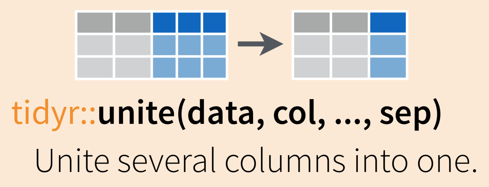

# Tidying 

### Possible name update TODO: Reshaping and tidying

## Summary

In previous sessions, we learned to read in data, do some wrangling, and create a graph and table. Here, we'll continue by *reshaping* data frames (converting from long-to-wide, or wide-to-long format), *separating* and *uniting* variable (column) contents, converting between *explicit* and *implicit* missing (`NA`) values, and cleaning up our column names with the `janitor` package. 

## Objectives

- Convert column names with `janitor::clean_names()`
- Reshape data frames with `tidyr::pivot_longer()` and `tidyr::pivot_wider()`
- Combine or separate information from columns with `tidyr::separate()` and `tidyr::unite()`
- Make implicit missings *explicit* with `tidyr::complete()`
- Make explicit missings *implicit* with `tidyr::drop_na()`
- Use our new skills as part of a bigger wrangling sequence
- Make a customized table 

## Resources

-- [Ch. 12 *Tidy Data*, in R for Data Science](https://r4ds.had.co.nz/tidy-data.html) by Grolemund & Wickham
- [`tidyr` documentation from tidyverse.org](https://tidyr.tidyverse.org/)
- [`janitor` repo / information](https://github.com/sfirke/janitor) from Sam Firke

## Lesson

### Lesson Prep

#### Create a new R Markdown and attach packages

Within your day 2 R Project, create a new .Rmd. Attach the `tidyverse`, `janitor` and `readxl` packages with `library(package_name)`. Knit and save your new .Rmd within the project folder. 

```{r, include = FALSE}
# Attach packages
library(tidyverse)
library(janitor)
library(readxl)
library(kableExtra)
```

```{r, eval = FALSE}
# Attach packages
library(tidyverse)
library(janitor)
library(readxl)
```

#### Read in data

Use `readxl::read_excel()` to import the "invert_counts_curated.xlsx" data:
```{r, include = FALSE}
inverts_df <- readxl::read_excel(here::here("curation", "invert_counts_curated.xlsx"))
```

```{r, eval = FALSE}
inverts_df <- readxl::read_excel("invert_counts_curated.xlsx")
```

Be sure to explore the imported data a bit: 

- `View()`
- `names()`
- `summary()`

### Reshaping with `tidyr::pivot_longer()` and `tidyr::pivot_wider()`

#### Wide-to-longer format with `tidyr::pivot_longer()`

In *tidy format*, each variable is contained within a single column. If we look at *inverts_df*, we can see that the *year* variable is actually split over 3 columns, so we'd say this is currently in **wide format**. 

There may be times when you want to have data in wide format, but often with code it is more efficient to convert to **long format** by gathering together observations for a variable that is currently split into multiple columns. 

Schematically, converting from wide to long format looks like this: 


Generally, the code to gather wide columns together using `tidyr::pivot_longer()` looks like this: 

TODO: Add pivot_longer() schematic

We'll use `tidyr::pivot_longer()` to gather data from all years in *inverts_df* into two columns: one called *year*, which contains the year (as a number), and another called *sp_count* that contains the number of each species observed. The new data frame will be stored as *inverts_long*:

```{r}

inverts_long <- tidyr::pivot_longer(data = inverts_df, 
                                    cols = '2016':'2018',
                                    names_to = "year",
                                    values_to = "sp_count")

```

The outcome is the new long-format *inverts_long* data frame:
```{r}
inverts_long
```

Hooray, long format! 

One thing that isn't obvious at first (but would become obvious if you continued working with this data) is that since those year numbers were initially column names (characters), when they are stacked into the *year* column, their class wasn't auto-updated to numeric. 

Explore the class of *year* in *inverts_long*:

```{r}
class(inverts_long$year)
```

We'll use `dplyr::mutate()` in a different way here: to create a new column (that's how we've used `mutate()` previously) that has the same name of an existing column, in order to update and overwrite the existing column. 

In this case, we'll `mutate()` to add a column called *year*, which contains an `as.numeric()` version of the existing *year* variable: 

```{r}

# Coerce "year" class to numeric: 

inverts_long <- inverts_long %>% 
  mutate(year = as.numeric(year))

```

Checking the class again, we see that *year* has been updated to a numeric variable:

```{r}
class(inverts_long$year)
```

#### Long-to-wider format with `tidyr::pivot_wider()`

In the previous example, we had information spread over multiple columns that we wanted to *gather*. Sometimes, we'll have data that we want to *spread* over multiple columns. 

For example, imagine that starting from *inverts_long* we want each species in the *common_name* column to exist as its **own column**. In that case, we would be converting from a longer to a wider format, and will use `tidyr::pivot_wider()` as follows: 

TODO: Add pivot_wider() schematic

Specifically for our data, we write code to spread the *common_name* column as follows: 
```{r}

inverts_wide <- inverts_long %>% 
  tidyr::pivot_wider(names_from = common_name, 
                     values_from = sp_count)

```

```{r}
inverts_wide
```

We can see that now each *species* has its own column (wider format). 

If we wanted to then use these columns (which we probably would, since we created them), we could clean the names to get them into more coder-friendly lower_snake_case with `janitor::clean_names()`:

```{r}
inverts_wide <- inverts_wide %>% 
  janitor::clean_names()
```

```{r}
names(inverts_wide)
```

### Combine or separate information in columns with `tidyr::separate()` and `tidyr::unite()`

Sometimes we'll want to *separate* contents of a single column into multiple columns, or *combine* entries from different columns into a single column. 

For example, the following data frame has *genus* and *species* in separate columns:
```{r, echo = FALSE}
unite_ex <- tribble(
  ~id, ~genus, ~species, ~common_name,
  1, "Scorpaena", "guttata", "sculpin",
  2, "Sebastes", "miniatus", "vermillion"
)

kable(unite_ex)
```

We may want to combine the genus and species into a single column, *scientific_name*: 
```{r, echo = FALSE}
unite_ex_sci_name <- unite_ex %>% 
  unite("scientific_name", 
        c(genus, species),
        sep = " ")

kable(unite_ex_sci_name)
```

Or we may want to do the reverse (separate information from a single column into multiple columns). Here, we'll learn `tidyr::unite()` and `tidyr::separate()` to help us do both. 

#### `tidyr::unite()` to merge information from separate columns

Use `tidyr::unite()` to combine (paste) information from multiple columns into a single column (as for the scientific name example above)



To demonstrate uniting information from separate columns, we'll make a single column that has the combined information from *site* abbreviation and *year* in *inverts_wide*. 


#### `tidyr::separate()` to separate information into multiple columns

